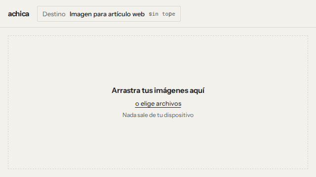

# achica

Comprime y convierte **muchas imágenes a la vez**, en tu navegador. Sin backend, sin cuentas, sin límite de archivos.



Ningún byte de tus imágenes sale de tu dispositivo, y no hace falta creernos: abre las herramientas de desarrollo, pestaña Red, y comprime una carpeta entera. **La aplicación no hace ninguna petición después de cargar.**

Eso está verificado en cada corrida de CI, no solo afirmado acá. `npm run smoke` maneja la aplicación construida en Chromium y en Firefox, registra **todas** las peticiones que hace la página y falla si alguna sale del origen. Es el instrumento que esta promesa siempre necesitó: la Fase 0 medía desde dentro de la página con Resource Timing, que es un piso y no un registro completo, y así quedó documentado en su momento.

Contra el sitio desplegado la misma comprobación se corre así: `node scripts/smoke.mjs https://achica.gfcode.dev`. Ahí aparecen **tres peticiones al mismo origen** bajo `/cdn-cgi/challenge-platform/`, y el comando las nombra una por una en lugar de esconderlas. Son de la protección anti-bots de Cloudflare, no las hace nuestro código, no llevan datos de imagen, y desaparecen al autohospedar el proyecto — que es exactamente para lo que la licencia es MIT.

## El problema

Tienes 40 fotos de 4 MB salidas del celular y hacen falta livianas: para un artículo, para un correo, para mandarlas por mensajería. Las herramientas disponibles o cobran pasadas las 20 imágenes, o suben los archivos a un servidor ajeno, o exigen elegir "calidad 75" sin explicar qué significa eso para lo que vas a hacer con la foto.

## Tres ejes

Cada decisión de este proyecto se justifica contra al menos uno de estos tres. Si una función no encaja en ninguno, no entra.

### 1. Abierto y sin topes

Licencia MIT, autohospedable, sin límite de archivos, sin cuentas, sin telemetría. La alternativa habitual es freemium cerrado con topes artificiales de 20 a 100 imágenes.

### 2. Perfiles por destino, no por calidad

No eliges "calidad 75". Eliges a dónde va la imagen — "imagen para artículo web", "adjunto de correo", "enviar por mensajería", "miniatura" — y la app resuelve formato, dimensiones y calidad.

Los cuatro son recomendaciones nuestras y cada fila del selector lo dice. Ninguno cita una autoridad externa porque ninguno la tiene, y disfrazarlo sería la deshonestidad exacta que la regla de la fuente existe para impedir. El grupo de perfiles por trámite salió del producto (D48): existió con la lista vacía durante toda la v1 y nunca recibió un perfil.

**Solo el perfil web cambia la extensión** (D49), porque ahí convertir a WebP es lo que se está pidiendo. Los otros tres devuelven el formato que recibieron: un `.png` que vuelve `.jpg` cambia el nombre que vas a buscar y pierde la transparencia sin avisar.

### 3. Presupuesto de peso de primera clase

"Déjalas todas bajo 100 KB" es la operación principal, no una casilla escondida. Está implementado y probado en el núcleo, pero desde D49 ningún perfil lo usa, así que hoy no se alcanza desde la interfaz. Es el eje que queda pendiente.

## Estado

**Terminado y en uso.** El flujo está completo: se arrastra una carpeta, se elige el destino, la cola muestra estado, ahorro y peso contra presupuesto archivo por archivo, y los resultados se descargan como ZIP o se escriben directo en una carpeta donde el navegador lo permite. Desplegado en https://achica.gfcode.dev


La barra de cada fila es el peso original; el relleno, lo que pesa ahora; y la marca vertical, dónde cae el presupuesto. Solo aparece en los archivos a los que el presupuesto de verdad limita: en la captura, únicamente el primero. El lote entero se lee de un vistazo sin leer una sola cifra.

Contra la definición de terminado de la v1 ([`docs/spec.md`](docs/spec.md), sección 10): **diez de doce puntos completos**. Los dos que faltan no son deuda pendiente sino decisiones tomadas con evidencia — HEIC de entrada y la opción de conservar metadatos — y están explicadas en [limitaciones conocidas](#limitaciones-conocidas).

El plan completo por fases está en [`docs/spec.md`](docs/spec.md). Las decisiones técnicas y por qué se tomaron, en [`docs/decisiones.md`](docs/decisiones.md).

## Memoria de la cola

La aceptación de la Fase 2 es procesar 200 imágenes sin que la memoria de la pestaña crezca de forma monótona. `npm run bench` hace esa corrida y la mide.

Corrida de 200 copias de una foto de 2 MP (70,5 MB de entrada), perfil WebP con presupuesto de 120 KB y ancho máximo de 1280. Los pesos van en miles y la memoria en potencias de dos, que es como se mide cada cosa:

| Concurrencia | Tiempo  | Pico residente | Sobre la línea base | Salida  |
| ------------ | ------- | -------------- | ------------------- | ------- |
| 4            | 64,2 s  | 1481,8 MiB     | 948 MiB             | 23,6 MB |
| 2            | 113,2 s | 1053,5 MiB     | 519 MiB             | 23,6 MB |

Durante la corrida la memoria oscila en diente de sierra —de ~1270 a ~1480 MiB con cuatro workers— **sin tendencia ascendente**: medido desde el archivo 50 en adelante, el crecimiento por archivo es negativo. Lo que decide el pico es la concurrencia, no el largo de la cola: unos 240 MiB por worker, casi todo memoria lineal de WebAssembly, que una vez que crece no se devuelve. Por eso el tope de concurrencia es 4 y no el número de núcleos.

Cómo se mide, y por qué así: **ningún medidor accesible desde dentro de la página dice la verdad**. `performance.memory.usedJSHeapSize` devuelve 10.000.000 constante en Chromium incluso tras reservar 50 MB; `performance.measureUserAgentSpecificMemory()` se niega a correr aunque `crossOriginIsolated` sea `true`; y la métrica de montón de CDP no cuenta los `ArrayBuffer`, que es justo donde vive un bitmap decodificado. El banco mide desde fuera, sumando la memoria residente de todo el árbol de procesos de Chrome, que es la misma cantidad que muestra el administrador de tareas del navegador.

Lo que esta corrida **no** cubre: el spec pone como piso una cola de 300 fotos de 12 MP, y el banco automático usa una foto de 2 MP. El costo que escala con los megapíxeles es el de cada worker, no el de la cola. Para verificar el caso grande, abre `bench.html` con `npm run dev`, arrastra una carpeta con tus propias fotos y graba con el perfilador de memoria de Chrome; los archivos reales están respaldados en disco, que es el escenario que importa.

## Desarrollo

```bash
npm install
npm run dev        # servidor local
npm run build      # build estático a dist/
npm run typecheck  # tsc --noEmit
npm run lint       # eslint
npm run test       # vitest
npm run smoke      # el build de producción, de punta a punta, en los dos navegadores
npm run bench      # 200 imágenes por la cola real, midiendo memoria
npm run screenshot # regenera las capturas del README
npm run gif        # regenera la animación del README
```

`npm run smoke` necesita `npm run build` antes: corre contra `dist/`, servido con las mismas cabeceras que manda el host, para que un problema de cabeceras o de empaquetado falle acá y no después de desplegar. Pasándole una URL comprueba un despliegue en vivo: `node scripts/smoke.mjs https://achica.gfcode.dev`.

## Decisiones de arquitectura

Las 43 decisiones, con su contexto y su consecuencia, están en [`docs/decisiones.md`](docs/decisiones.md). Las que más forma le dan al proyecto:

- **`core/` no importa React ni toca el DOM**, y no es una convención: ESLint lo verifica y CI falla si alguien la rompe. Hay un test que protege esa verificación, para que aflojar la regla también falle.
- **Cancelar es terminar el worker.** El `AbortController` que pedía el spec no puede cruzar al worker — `AbortSignal` no es clonable por estructura, comprobado con `DataCloneError` en Chromium — y una codificación WASM es síncrona, así que ninguna bandera cooperativa la interrumpe. El pool es dueño del ciclo de vida de los workers por eso.
- **La memoria está acotada por la concurrencia, no por el largo de la cola.** Unos 240 MiB por worker, medidos. Los resultados viven como `Blob`, que el navegador puede respaldar en disco, y nunca como arreglos tipados.
- **Un presupuesto que el archivo ya cumple no es un objetivo.** Si ya entra, se codifica una vez con la calidad del perfil en lugar de buscar contra su propio tamaño y devolver un 1 % de ahorro.
- **Un perfil de trámite sin fuente no compilaba.** La regla más importante del producto era un tipo y no un comentario. El grupo salió en D48; la regla quedó escrita en `types.ts` por si vuelve.
- **Las tres señales de color están medidas** contra simulación de daltonismo: ninguna combinación baja de ΔE 21,8, y verde/ámbar/rojo se descartó con el número que lo condena.

## Limitaciones conocidas

Escritas acá porque descubrirlas usando la herramienta es peor que leerlas antes.

- **HEIC no entra en esta versión.** Las fotos de iPhone se detectan y se rechazan con un mensaje que dice qué hacer, en lugar de fallar de forma rara. Las dos librerías disponibles son LGPL-3.0 y chocan con el eje MIT del producto.
- **Los metadatos siempre se eliminan.** Los códecs de este stack no escriben metadatos, así que `stripMetadata: false` no es entregable. La orientación EXIF ya está aplicada a los píxeles antes de codificar, así que no se pierde nada visible.
- **Un PNG que ya cabe en el límite de dimensiones de su perfil sale igual de pesado.** PNG no tiene perilla de calidad, así que si tampoco hay que achicarlo no queda ninguna palanca. Medido en D49: «Adjunto de correo» sobre un PNG de 1800x1200 ahorra 0,0 %. La interfaz lo marca como fallo en lugar de esconderlo, pero el arreglo real es instalar `@jsquash/oxipng`, que está en el stack acordado y nunca se instaló.
- **El ZIP se arma entero antes de entregarse.** En un lote grande hay una segunda copia de todo lo comprimido, respaldada en disco por el navegador. Guardar en una carpeta escribe archivo por archivo y no acumula: es el camino que conviene con cientos de fotos, y por eso sigue estando.
- **Guardar en una carpeta solo existe en Chromium.** Firefox y Safari no tienen File System Access API; ahí el ZIP es el único camino, y funciona.
- **El caso de 300 fotos de 12 MP no está verificado de forma automática.** El banco usa una foto de 2 MP. Lo que escala con los megapíxeles es el costo por worker, no el de la cola, pero eso es un razonamiento y no una medición.
- **El pico de memoria es alto.** Con cuatro workers, unos 950 MiB sobre la línea base. Está acotado y no crece con el lote, pero una máquina con poca RAM va a sentirlo. La concurrencia baja sola en máquinas con menos núcleos.

## Licencia

MIT. Ver [`LICENSE`](LICENSE).
