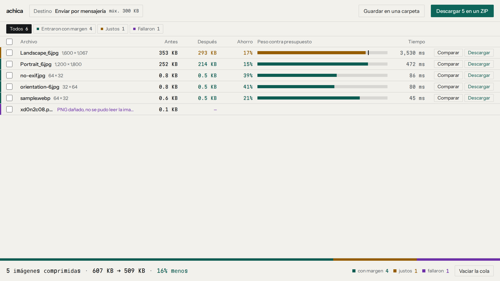

# achica

Comprime y convierte **muchas imágenes a la vez**, en tu navegador. Sin backend, sin cuentas, sin límite de archivos.

Ningún byte de tus imágenes sale de tu dispositivo, y no hace falta creernos: abre las herramientas de desarrollo, pestaña Red, y comprime una carpeta entera. **La aplicación no hace ninguna petición después de cargar.**

En el sitio desplegado sí aparecen unas pocas peticiones al mismo origen bajo `/cdn-cgi/`. Son de la protección anti-bots de Cloudflare, no las hace nuestro código, no llevan datos de imagen, y desaparecen al autoalojar el proyecto — que es exactamente para lo que la licencia es MIT. La propia página las cuenta y las muestra, separadas de las nuestras, para que nadie tenga que confiar en este párrafo. Esa cuenta es un piso, no un total: la API del navegador que la mide no registra todas las peticiones, y la página lo dice en lugar de aparentar exactitud. La autoridad sigue siendo la pestaña Red, y el código que hace la cuenta está acá para leerlo.

## El problema

Un trámite pide fotos "de menos de 500 KB". Tienes 40 fotos de 4 MB salidas del celular. Las herramientas disponibles o cobran pasadas las 20 imágenes, o suben los archivos a un servidor ajeno, o exigen elegir "calidad 75" sin explicar qué significa eso para el límite que hay que cumplir.

## Tres ejes

Cada decisión de este proyecto se justifica contra al menos uno de estos tres. Si una función no encaja en ninguno, no entra.

### 1. Abierto y sin topes

Licencia MIT, autohospedable, sin límite de archivos, sin cuentas, sin telemetría. La alternativa habitual es freemium cerrado con topes artificiales de 20 a 100 imágenes.

### 2. Perfiles por destino, no por calidad

No eliges "calidad 75". Eliges a dónde va la imagen — "Mesa de Partes", "foto para ficha", "adjunto de correo" — y la app resuelve formato, peso máximo y dimensiones.

Los perfiles de trámites solo se agregan con fuente oficial verificable y fecha de verificación. Un perfil con un límite equivocado es peor que no tener el perfil: el usuario descubre el error recién cuando le rechazan el trámite.

### 3. Presupuesto de peso de primera clase

"Déjalas todas bajo 100 KB" es la operación principal, no una casilla escondida.

## Estado

**Fase 4 cerrada.** El flujo está completo: se arrastra una carpeta, se elige el destino, la cola muestra estado, ahorro y peso contra presupuesto archivo por archivo, y los resultados se descargan como ZIP o se escriben directo en una carpeta donde el navegador lo permite. Desplegado en https://achica.gfcode.dev



La barra de cada fila es el peso original; el relleno, lo que pesa ahora; y la marca vertical, dónde cae el presupuesto. Solo aparece en los archivos a los que el presupuesto de verdad limita: en la captura, únicamente el primero. El lote entero se lee de un vistazo sin leer una sola cifra.

El plan completo por fases está en [`docs/spec.md`](docs/spec.md). Las decisiones técnicas y por qué se tomaron, en [`docs/decisiones.md`](docs/decisiones.md).

## Memoria de la cola

La aceptación de la Fase 2 es procesar 200 imágenes sin que la memoria de la pestaña crezca de forma monótona. `npm run bench` hace esa corrida y la mide.

Corrida de 200 copias de una foto de 2 MP (70,5 MB de entrada), perfil WebP con presupuesto de 120 KB y ancho máximo de 1280. Los pesos van en miles y la memoria en potencias de dos, que es como se mide cada cosa:

| Concurrencia | Tiempo  | Pico residente | Sobre la línea base | Salida  |
| ------------ | ------- | -------------- | ------------------- | ------- |
| 4            | 64,2 s  | 1481,8 MiB     | 948 MiB             | 23,6 MB |
| 2            | 113,2 s | 1053,5 MiB     | 519 MiB             | 23,6 MB |

Durante la corrida la memoria oscila en diente de sierra —de ~1270 a ~1480 MiB con cuatro workers— **sin tendencia ascendente**: medido desde el archivo 50 en adelante, el crecimiento por archivo es negativo. Lo que decide el pico es la concurrencia, no el largo de la cola: unos 240 MiB por worker, casi todo memoria lineal de WebAssembly, que una vez que crece no se devuelve. Por eso el tope de concurrencia es 4 y no el número de núcleos.

Cómo se mide, y por qué así: **ningún medidor accesible desde dentro de la página dice la verdad**. `performance.memory.usedJSHeapSize` devuelve 10.000.000 constante en Chromium incluso tras reservar 50 MB; `performance.measureUserAgentSpecificMemory()` se niega a correr aunque `crossOriginIsolated` sea `true`; y la métrica de montón de CDP no cuenta los `ArrayBuffer`, que es justo donde vive un bitmap decodificado. El banco mide desde fuera, sumando la memoria residente de todo el árbol de procesos de Chrome, que es la misma cantidad que muestra el administrador de tareas del navegador.

Lo que esta corrida **no** cubre: el spec pone como piso una cola de 300 fotos de 12 MP, y el banco automático usa una foto de 2 MP. El costo que escala con los megapíxeles es el de cada worker, no el de la cola. Para verificar el caso grande, abre `bench.html` con `npm run dev`, arrastra una carpeta con tus propias fotos y graba con el perfilador de memoria de Chrome; los archivos reales están respaldados en disco, que es el escenario que importa.

## Desarrollo

```bash
npm install
npm run dev        # servidor local
npm run build      # build estático a dist/
npm run typecheck  # tsc --noEmit
npm run lint       # eslint
npm run test       # vitest
npm run bench      # 200 imágenes por la cola real, midiendo memoria
npm run screenshot # regenera las capturas del README
npm run verify:download # descarga el ZIP en Chromium y en Firefox y lo revisa
```

## Licencia

MIT. Ver [`LICENSE`](LICENSE).
